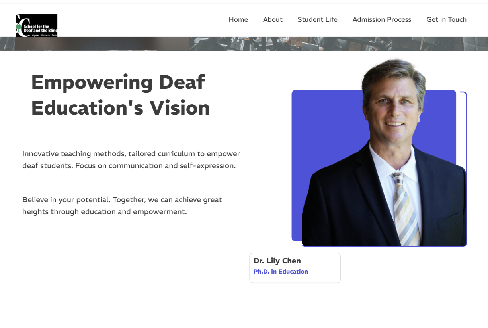

# Inclusive Education for the Deaf & Blind

This project showcases how a dedicated educational platform can empower deaf and blind students. Designed using WordPress and one.com, the site imagines what an inclusive school might offer.

## Features
- Multi-section homepage 
- Overview of student life, admission process, and facilities
- Awareness programs like ASL workshops and Deaf Awareness Day
- Motivational quotes and accessibility-centered approach

> ⚠️ Note: This is a conceptual project for design demonstration. All names and institutions used are fictional.

## Built With
- WordPress
- One.com

## 📸 Preview

- Homepage
  
  
- Faculty Team
  

- Admission  
  

- Student life
  

- Vision
  

- School Facilities
  

- Activities
  

- Importance
  

- Get in touch
  
            

## Author
Srishti Shukla
